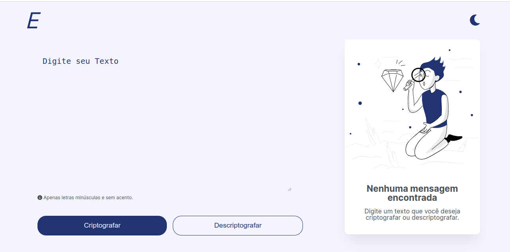
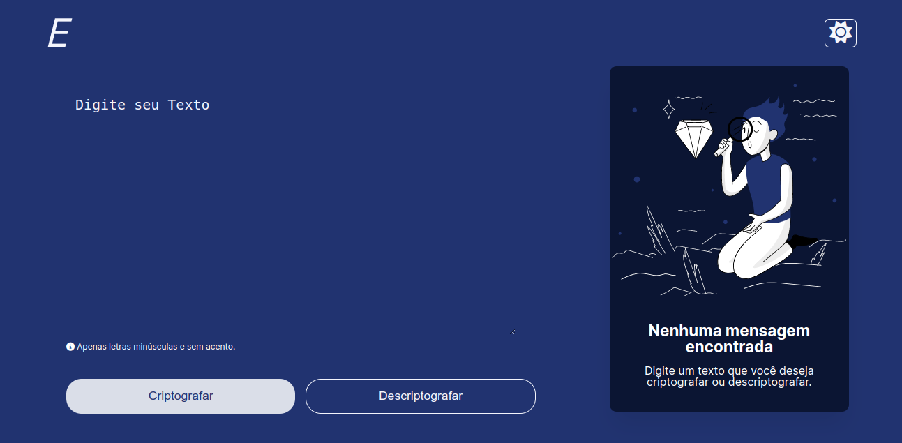

# Text-decoder

   
   

 

Construção de um decodificador de texto com Javascript(Vanilla). Esse foi um challege proposto <b>ONE</b> com a <b>Alura</b>.

Nesse decodificador é posssivel decodificar e descodificar os textos inseridos.

Também a uma feature de <b>darkMode</b> onde é posssivel mudar de tema escuro e claro.

## Tecnologias

- HTML
- CSS
- Javascript

## Acessar Aplicação

<a  target="_blank" href="https://emillyalmeida.github.io/text-decoder/">Clique aqui !!!</a>
